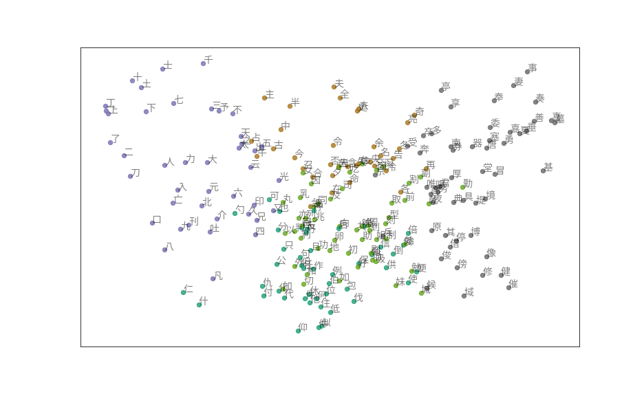

# Chinese-character-classification

## Description

This project is an exploration in the relationships between Chinese logograms. We cluster Chinese characters and study the connections between the clusters in the underlying network. Potentially, we can observe how the histories of these characters evolve over time. This project is in progress.

## Data

The data comes from this interesting post: [Making of a Chinese Characters dataset](https://blog.usejournal.com/making-of-a-chinese-characters-dataset-92d4065cc7cc)

## Contributing

Please contact me if you have any good ideas about this project!

## Further reading
